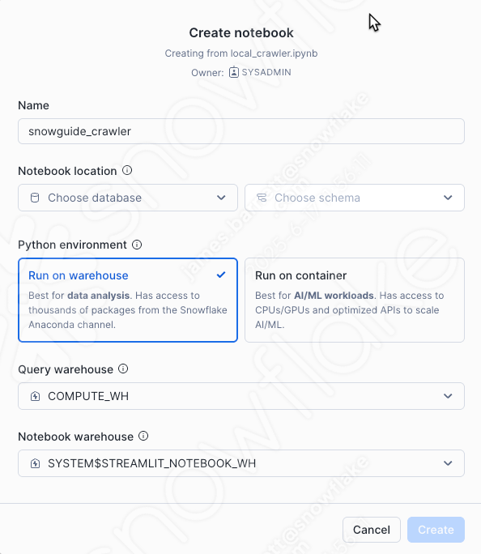
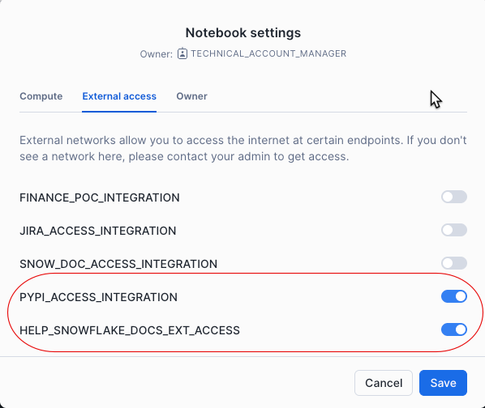
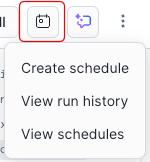

# Running in Notebooks

This can be run in a Snowflake Notebook either in a warehouse or an SPCS container. If you choose to run the Crawler and Loader in a notebook we recommend using SPCS. Running in a warehouse is a good choice if you want to debug or test something out. We recommend a medium or large warehouse for these processes. If using SPCS you must have setup a Compute Pool (done in Common Setup).

**Usage**
1. Create a Notebook in Snowsight by importing local_crawler.ipynb

2. Change the Notebook settings and set the External Access Integration and the Pip Integration. In this case use integration "slack_apis_access_integration" created in setup.sql and the PyPi integration creatred by your admininstrator.

3. Run the notebook

4. If you want to schedule the notebook to run periodically, select the calendar icon and set the desired schedule. 

